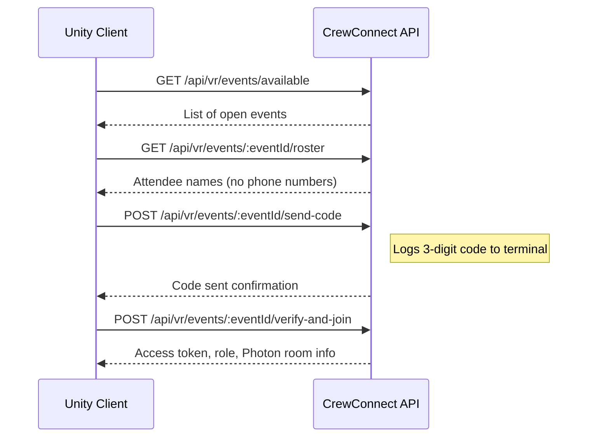

# Mock CrewConnect API

A mock REST API server for the CrewConnect VR training platform. Provides admin event management and a VR client authentication/join flow with SMS code verification.

## Setup

```bash
npm install
npm start
```

Server runs on **http://localhost:5055**

## Architecture

- **Express** server with in-memory storage (no database)
- **Admin Panel** — served at root (`/`) for managing events and attendees
- **VR API** — endpoints consumed by a Unity client for event discovery, identity verification, and session joining

---

## API Endpoints

### Admin API

#### `GET /api/admin/events`

List all events with attendee counts.

**Response:**
```json
{
  "success": true,
  "events": [
    {
      "eventId": "event_1001",
      "eventName": "Brava Roof Training - Test Event",
      "eventType": "multiplayer",
      "status": "open",
      "photonSessionName": "cc_event_1001",
      "maxTrainerSlots": 1,
      "maxTraineeSlots": 3,
      "observersAllowed": true,
      "attendeeCount": 5
    }
  ]
}
```

---

#### `POST /api/admin/events`

Create a new event.

**Body:**
| Field | Type | Required | Default |
|-------|------|----------|---------|
| `eventName` | string | Yes | — |
| `eventType` | string | No | `"multiplayer"` |
| `maxTrainerSlots` | number | No | `1` |
| `maxTraineeSlots` | number | No | `3` |
| `observersAllowed` | boolean | No | `true` |

**Response:**
```json
{
  "success": true,
  "event": { "eventId": "event_1002", "eventName": "...", "status": "open", "..." : "..." }
}
```

---

#### `PATCH /api/admin/events/:eventId`

Update event properties (status, name, slots).

**Body (all optional):**
```json
{
  "status": "open" | "closed",
  "eventName": "New Name",
  "maxTrainerSlots": 2,
  "maxTraineeSlots": 5,
  "observersAllowed": false
}
```

---

#### `DELETE /api/admin/events/:eventId`

Delete an event and all its attendees/session state.

---

#### `GET /api/admin/events/:eventId/attendees`

List all attendees for an event.

**Response:**
```json
{
  "success": true,
  "eventId": "event_1001",
  "attendees": [
    {
      "attendeeId": "att_001",
      "name": "John Mitchell",
      "company": "Brava Roofing Co.",
      "crew": "Alpha",
      "role": "trainer",
      "phone": "9999991111"
    }
  ]
}
```

---

#### `POST /api/admin/events/:eventId/attendees`

Add an attendee to an event.

**Body:**
| Field | Type | Required |
|-------|------|----------|
| `name` | string | Yes |
| `phone` | string | Yes |
| `role` | string (`trainer` / `trainee` / `observer`) | Yes |
| `company` | string | No |
| `crew` | string | No |

---

#### `DELETE /api/admin/events/:eventId/attendees/:attendeeId`

Remove an attendee from an event.

---

### VR API (Unity Client)

#### `GET /api/vr/events/available`

Get all open events the VR client can join.

**Response:**
```json
{
  "events": [
    {
      "eventId": "event_1001",
      "eventName": "Brava Roof Training - Test Event",
      "status": "open",
      "joinWindowOpen": true,
      "photonSessionName": "cc_event_1001",
      "maxTrainerSlots": 1,
      "maxTraineeSlots": 3
    }
  ]
}
```

---

#### `GET /api/vr/events/:eventId/roster`

Get the attendee roster (without phone numbers) for display in VR.

**Response:**
```json
{
  "success": true,
  "eventId": "event_1001",
  "roster": [
    { "attendeeId": "att_001", "name": "John Mitchell", "company": "Brava Roofing Co.", "crew": "Alpha", "role": "trainer" }
  ]
}
```

---

#### `POST /api/vr/events/:eventId/send-code`

Request an SMS verification code for an attendee. Code is logged to the server terminal.

**Body:**
```json
{ "attendeeId": "att_001" }
```

**Response:**
```json
{
  "success": true,
  "codeLength": 3,
  "expiresInSeconds": 300,
  "message": "Verification code sent to John Mitchell."
}
```

---

#### `POST /api/vr/events/:eventId/verify-and-join`

Verify the SMS code and join the event session. Assigns role and Photon room info.

**Body:**
```json
{ "attendeeId": "att_001", "code": "482" }
```

**Response:**
```json
{
  "success": true,
  "accessToken": "mock_access_token_user_att_001",
  "user": {
    "userId": "user_att_001",
    "attendeeId": "att_001",
    "displayName": "John Mitchell",
    "company": "Brava Roofing Co.",
    "crew": "Alpha"
  },
  "event": { "eventId": "event_1001", "status": "open", "joinWindowOpen": true },
  "roleAssignment": {
    "eventRole": "trainer",
    "activeSessionRole": "trainer",
    "slotId": null,
    "isPrimaryTrainer": true
  },
  "photon": {
    "photonSessionName": "cc_event_1001",
    "oneEventOneRoom": true,
    "roomAlreadyCreated": false,
    "createdPhotonRoomByThisUser": true
  }
}
```

**Role assignment logic:**
- First `trainer` to join becomes the active trainer; subsequent trainers become observers.
- `trainee` users fill available slots; if full, they become observers.
- `observer` role always stays observer.

---

#### `GET /api/vr/events/:eventId/session-status`

Get current session state (slots, trainer, room status).

---

#### `POST /api/vr/events/:eventId/participation`

Leave an event session.

**Body:**
```json
{ "userId": "user_att_001", "action": "leave" }
```

---

#### `POST /api/vr/events/:eventId/users/:userId/heartbeat`

Send a heartbeat to keep the user session alive.

---

#### `POST /api/vr/debug/reset`

Reset all in-memory session state (does not delete events/attendees).

---

## VR Join Flow



## Notes

- All data is stored **in-memory** — restarting the server resets everything.
- SMS codes are **printed to the server terminal** (no actual SMS integration).
- Codes expire after **5 minutes**.
- The admin panel is served as static files from the `public/` directory.
